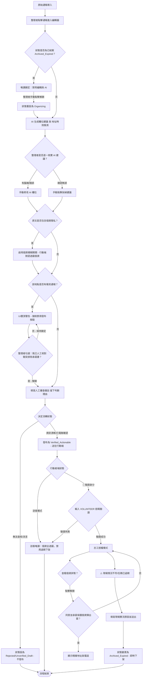

# 資訊流程設計

> 這份文件可以由 Codex 先產生草稿，但你必須用 VS Code 預覽 Mermaid，並由人檢查流程是否合理。

## 我的 v1 目標

- 我優先服務的使用者：資訊整理者
- 這個使用者最想完成的事：降低前線救災誤判風險，將混亂且真偽未辨的原始資料人工過濾與核查，加上判斷備註與隱私遮蔽，安全流轉為「已查實」草稿供行動者使用。
- 我最想避免的錯誤：AI腦補自動把模糊、無時戳或流言（M-004、M-005）標記為高品質並自動發布，導致志工前往錯誤的現場浪費人力。

## 自然語言流程描述

1. **原始通報導入**：系統從 `messy-reports.json` 中讀取未整理資料（此為起點），將其顯示在整理者的「待整理清單」中。
2. **觸發 AI 輔助標記與過期鎖定**：
   - 整理者點擊特定通報，載入編輯器。
   - **已過期唯讀鎖定防護**：若該通報已被前線標記為 `archived_expired`（過期結案），編輯器會自動啟用唯讀鎖定，禁用所有編輯框與 AI 按鈕，防止資料被 AI 或誤操作覆寫。整理者必須手動點選「解鎖重新整理」才可解除唯讀。
   - 正常狀態下，整理者點擊按鈕，系統調用 AI 生成草稿建議（信心度、可能類型、建議行動、地址與時效推測）。
3. **人工二次確認（防腦補）**：
   - AI 填入的所有欄位在 UI 上均標示為黃底的**「未複核建議」**（以黃色虛線框閃爍提示）。
   - 整理者核對 AI 推測結果，手動校正 AI 的日期或地址腦補（例如：M-005 截圖無日期，AI 腦補為今日，人工應予修正）。
   - 整理者必須對每個 AI 建議欄位點擊「確認採納」或直接進行「手動修改」，AI 建議標記才會消失，轉為「人類確認」。
4. **隱私個資判斷（防外洩）與遮蔽**：
   - 整理者檢查原文是否涉及受災個資（例如 M-011 的長輩電話、精確住址）。
   - 如果涉及，整理者必須勾選「敏感個資隱私開關」；啟用後，系統送往行動端的展示字串將被自動模糊化（遮蔽精確地址與電話）。
5. **相同地點衝突檢查與強攔截**：
   - 系統根據地址或地標，提示是否存在多筆內容衝突的通報（例如 M-006 關於側門是否淹水之爭議）。
   - 若有衝突，系統禁止 AI 自動合併，置頂顯示警示，並且**強制禁用發布按鈕**。
   - 整理者必須人工與衝突點聯絡核對後，勾選 **「我已人工聯絡核實衝突，確認非重複或衝突事件」** 承諾書，方可解除禁用發布。
6. **生命週期狀態流轉**：
   - 整理者輸入人工審查備註（必填），留下判斷理由。
   - **分支 A（無法查證/暫不處理）**：若地點過於模糊（M-003）且完全無聯絡電話，整理者將狀態設為 `rejected` 或保持 `unverified_draft`，保留文字紀錄但**不發布到前線任務看板**。
   - **分支 B（已查實可行動）**：若資訊清晰具體，且已與當事人電聯查證並確認個資授權，整理者確認無誤後點擊「發布」，狀態轉為 `verified_actionable`，發送至行動者唯讀看板。
7. **時效到期反向閉環與行動端權限**：
   - **雙重權限模式**：行動看板預設為「訪客唯讀模式」，精確地址與電話完全模糊，且無法進行現場過期下架。
   - **🔑 驗證志工身分**：行動者必須點選按鈕並輸入約定口令（VOLUNTEER）來解鎖「志工授權模式」。
   - **🔒 個資解鎖隱私承諾**：解鎖為志工後，地址電話預設仍是遮蔽的。志工點擊 `👁️ 顯示真實個資` 時，必須閱讀並同意「個人隱私承諾書」，承諾僅用於合作聯絡，方可解開模糊化。
   - **過期現場下架**：志工抵達現場發現任務已不在（物資空了 M-010、路障已清 M-005），點擊「現場實況不符/已過期」並輸入說明。送出後將資料狀態更新為 `archived_expired`，任務即時下架（此為終點）。

## Mermaid 流程圖

## 人工確認點

- **AI 建議覆核**：AI 生成的任何推估欄位（信心度、類型、地址、細部分類）必須由人工在編輯器中逐一確認（點選採納或直接修改）才能儲存，不進行任何自動化決策。
- **衝突排查承諾**：相同地點的多個衝突通報（如 M-006 側門淹水爭議）必須由人工電聯判定與備註，並勾選「已人工排除衝突」承諾，禁止盲目發布。
- **隱私解鎖與個資承諾**：行動端要查看受遮蔽的居民個資前，必須先透過「志工密碼」認證，並點選解鎖同意「隱私聲明與個資保護承諾」。
- **發布流轉決策**：人工確認無誤後點擊「發布」，才可流轉至行動看板。

## 不能自動處理的分支

- **模糊且無電話資料**：當地點過於模糊（M-003）且完全無聯絡電話時，系統不得自動標記為高品質或直接發布，必須手動歸入 `rejected`。
- **結案鎖定保護**：現場志工回報任務已過期已結案時，後台系統會自動唯讀鎖定草稿，防止 AI 自動化或二次編輯覆蓋結案現場說明。
- **志工下架機制**：必須由志工實地查核、填寫實況理由後才可觸發狀態變更。

## 操作或判斷紀錄

- **人工審查備註**：整理者發布時，必須填寫人工審查備註，記錄為何如此判斷（必填）。
- **個資保護開關**：整理者在後台點選「啟用個資保護」，是防範個資外洩的唯一邏輯閥值。
- **過期實況原因**：志工在現場下架任務時，必須輸入過期原因以結案存檔。

## 我檢查後修正了什麼

- **視覺混亂優化**：原先將 Phase 0 與 V1 混雜在側邊欄，改為在側邊欄劃分「集中式原型 (Phase 0)」與「角色分流工作台 (V1)」兩個明顯的 Section。
- **訪客與志工分權機制**：在行動看板加入了「訪客」與「認證志工」雙重權限，避免任何一般讀者皆能隨意觀看居民電話地址或隨意現場下架。
- **地區衝突承諾**：偵測到地區衝突時，強制攔截發布按鈕，必須勾選核對承諾書才能發布。
- **已結案唯讀鎖定**：對 status 為 `archived_expired` 的資料鎖定編輯器，防止 AI 智慧分析二次編輯覆蓋現場反饋。

## 我仍不確定的流程點

- **離線狀態下的草稿與回饋同步**：當前線行動者或現場整理者處於網路不穩定的災區時，如何在 localStorage 中進行草稿編輯、過期回報，並在恢復連線時與遠端同步？
- **衝突通報的地理範疇自動識別**：系統如何界定兩個通報屬於「相同地點」並發出衝突警示？如果是靠經緯度，在地址極度模糊（老雜貨店後面）的情況下，系統很難在前端自動精確識別。
